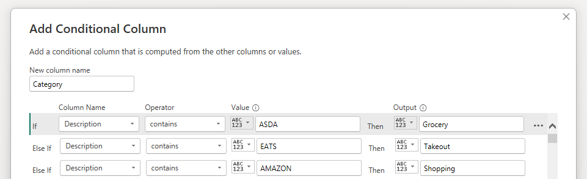

<h1 align="center">PowerBI Income-Expenses Tracker</a></h1>


<p align='center'>

</p>
<p align="center">
  <a href="#overview">Overview</a> •
  <a href="#architecture">Architecture</a> •
  <a href="#definitions">Definitions</a> •
  <a href="#dashboard">Dashboard</a> •
  <a href="#networking">Networking</a> •
  <a href="#license">License</a>
</p>


## Overview

Whether you're tracking personal finances, managing a small business, or simply looking for a better way to visualise your financial data, the `pbi-income-expenses-tracker` is your go-to solution. To modify the report you need a basic understanding of PowerBI and how to use the `PowerQuery Editor` and an elementary understanding of `M-code` to create categories faster.

### The 3F Method 

**Video Link (Nischa):** https://www.youtube.com/watch?v=4sT2B2SRypo

Effective money management involves balancing living in the moment and planning for the future. It’s essential to allocate funds towards essential needs, fun expenses, and future savings to achieve financial stability and security. The **3F Method** can help you achieve this.

- **Fundamentals (needs)**: This category should receive 50% of your income and includes essential expenses necessary for basic daily living. It covers housing, utilities, groceries, and healthcare costs, ensuring that all critical needs are met for stability and security.
- **Future (Savings/Investments)**: This segment is allocated 20% of your income. It focuses on savings and investments for long-term financial goals like retirement, emergency funds, or other investments such as stocks or real estate, building a foundation for future financial stability.
- **Fun (Socials/Leisure)**: This category is designated 30% of your income. It covers discretionary spending on leisure and social activities, including dining out, entertainment, vacations, and hobbies, allowing you to enjoy the present while staying financially balanced.


## Architecture

To setup the report, you must first create/format your input excel sheet (bank statement) to have the following columns:

- `Date:` This column records the date the income was received or the expense was incurred. The format typically used is DD/MM/YYYY or MM/DD/YYYY, depending on your regional settings. Keeping this column updated allows for chronological tracking of financial activities, enabling trend analysis, and facilitating the organization of data for reporting or auditing purposes.
- `Description:` This column provides details about the nature of the transaction. For income, this might include terms like "salary," "dividends," "interest income," or "sale proceeds." For expenses, it could detail the type of expenditure, such as "utilities," "rent," "groceries," "transportation," or "entertainment." The description is crucial for understanding each transaction's purpose and categorising the transactions for better financial analysis and budgeting.
- `Transaction:` This column records the amount of the transaction. Income amounts can be entered as positive numbers, while expenses are typically entered as negative numbers to differentiate them easily. This setup helps in quickly calculating the total income, total expenses, and net cash flow over a selected period. It's essential for maintaining accurate records of financial movements, enabling users to assess their spending habits, identify potential savings, and make informed financial decisions.

### Creating Categories

**a.** The categories are created and modified in the `PowerQuery Editor` by adding a conditional column called `Category`, to customise your report to meet your own financial groupings:

<p align='center'>

</p>

**b.** You can alternatively use `M-code` to add/replace the categories:

- `<previous-step-in-applied-steps>`: this is the name of the previous step in the `Applied Steps` pane in the `PowerQuery Editor`, this can be changed based on your preference, the code below shows the following category mapping

  | Shop name/Transaction Label       | Category   | 3F Category |
  | --------------------------------- | ---------- | ----------- |
  | ASDA                              | Grocery    | Fundamental |
  | EATS                              | Takeout    | Fun         |
  | AMAZON                            | Shopping   | Fun         |
  | MUKURU                            | Home       | Fundamental |
  | Udemy - Learning PowerBI          | Investment | Future      |
  | Pensions (Aviva)                  | Investment | Future      |
  | ISA (Tax-Free Investment Account) | Investment | Future      |
  | Studio58                          | Shopping   | Fun         |
  
  

```m-code
= Table.AddColumn(#"<previous-step-in-applied-steps>", "<new-column-name>", 
each if Text.Contains([Description], "ASDA") then "Grocery" 
else if Text.Contains([Description], "EATS") then "Takeout" 
else if Text.Contains([Description], "AMAZON") then "Shopping" 
else if Text.Contains([Description], "MUKURU") then "Home" 
else if Text.Contains([Description], "LIDL") then "Grocery"
else "Other")
```


